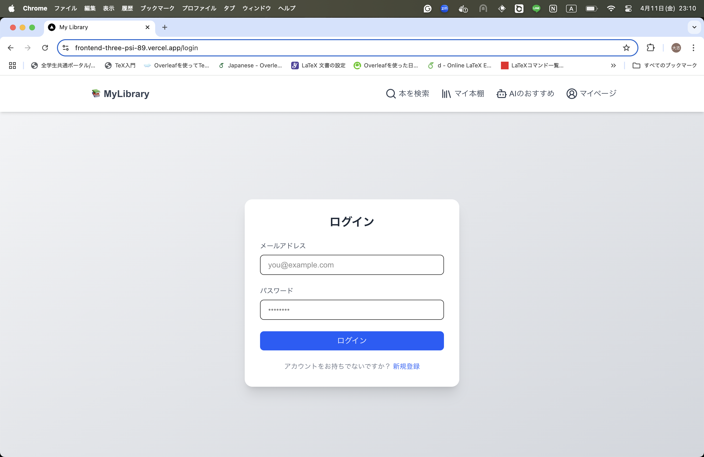
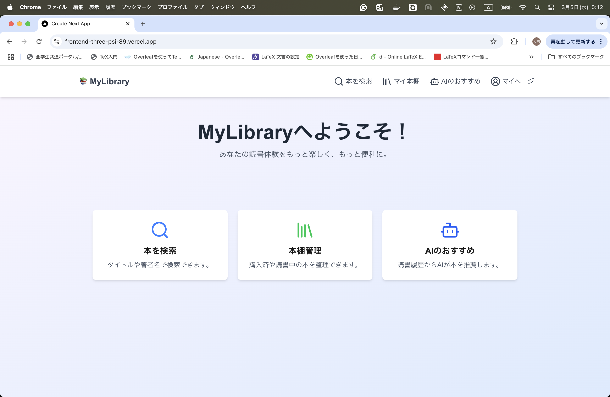
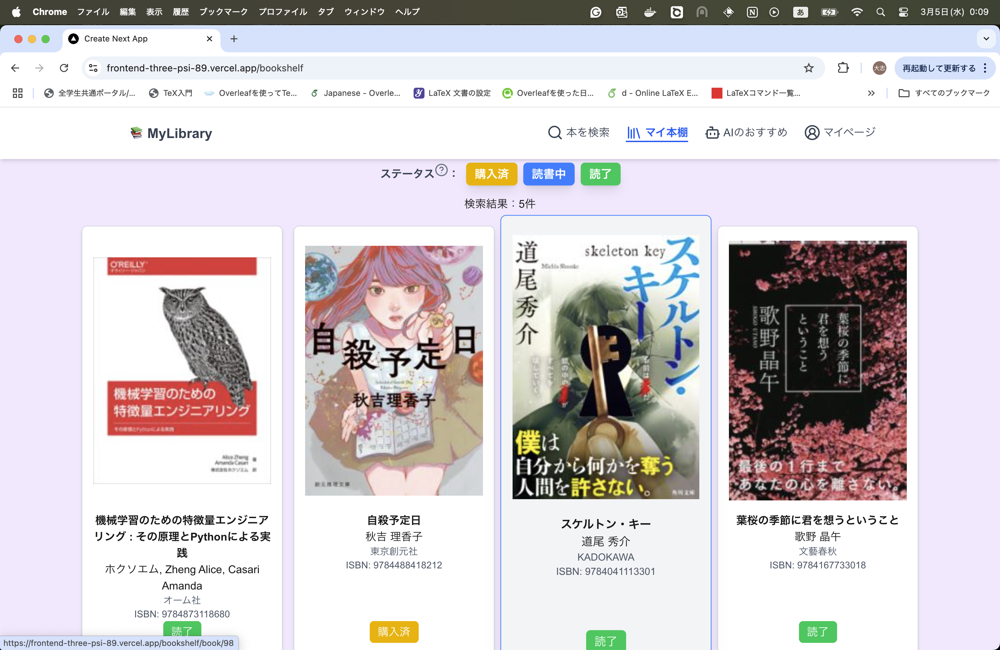
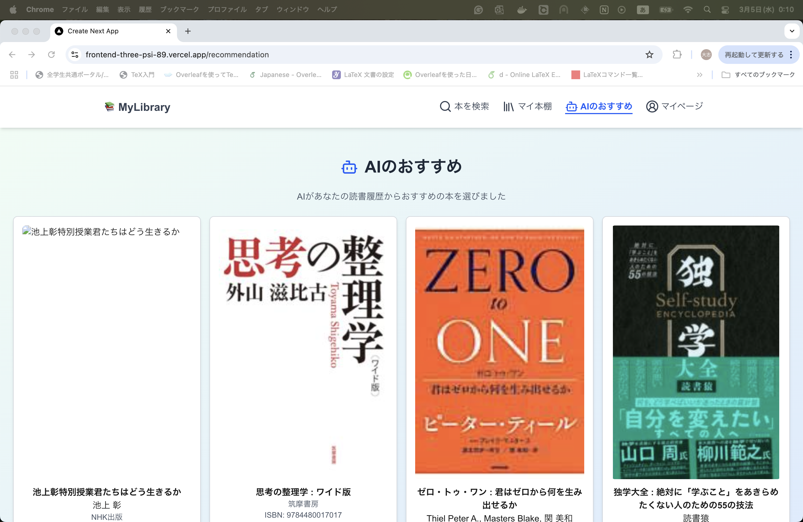

# book-management-app

## 経緯

積読が増える中で、自分がどの本をすでに購入したのか把握できず、同じ本を二度買ってしまうことがありました。この課題を解決するために、読書履歴や購入履歴を管理できる本の管理アプリを自作しました。

## 機能

- 買った本や読んだ本を管理
- 読書履歴から AI がおすすめの本を推薦
- 本の検索
- 無限スクロール
- 認証機能

#### ログイン画面

#### ホーム画面

#### 検索画面

#### マイ本棚

#### AI のおすすめ画面

## 技術スタック

### バックエンド

- Go v1.24.0
- Gin v1.10.0
- Gorm v.1.25.12
- PostgreSQL v17.4

### フロントエンド

- Next.js v15.2.0
- TypeScript v5.7.3

### インフラ

- Render (バックエンド用サーバー)
- Vercel (フロンエンド用サーバー)
- Docker
- Docker Compose
